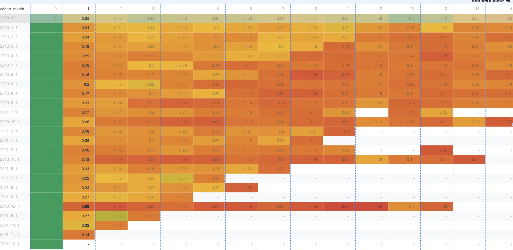

 Customer Revenue Concentration & Retention Analysis

Project Overview
This project analyzes revenue concentration and customer retention structure within an e-commerce dataset.

The goal is to understand:
- How revenue is distributed across customers
- The level of customer dependency
- Repeat purchase behavior
- Monthly revenue growth patterns


 Dataset
Online Retail II (UCI)  
~500K transaction records  
Fields: InvoiceDate, Customer ID, Quantity, Price

 Analysis Performed

1. Customer Lifetime Value (LTV)
- Calculated total revenue per customer
- Highest LTV exceeded $608K

2. Revenue Concentration (Pareto Analysis)
- Used SQL NTILE window function
- Top 10% customers (589 users) generated ~64% of total revenue

3. Repeat Purchase Rate
- 72% of customers made repeat purchases
- Indicates strong customer retention structure

4. Month-over-Month Growth
- Detected 50% revenue surge in March 2010
- Suggests potential seasonal or promotional impact


 Business Implications
- Revenue heavily depends on VIP segment
- Strong opportunity for targeted retention strategy
- Further analysis recommended on high-growth months


 RFM Customer Segmentation

To further understand customer behavior, RFM (Recency, Frequency, Monetary) analysis was performed.

Customers were segmented into:

- Champions (1,309 customers)
- Loyal (1,041 customers)
- New Customers (345 customers)
- At Risk – High Value (151 customers)
- Others (3,032 customers)

Key Observations
- Revenue is highly concentrated among high-frequency and high-monetary customers.
- A small but valuable "At Risk" group exists and may require retention strategies.
- The business shows a moderate dependency on repeat customers.
  
Business Problem

This project investigates whether revenue is sustainably diversified across customers or overly dependent on a small VIP segment.

Key business questions:
	•	How concentrated is revenue among top customers?
	•	What is the repeat purchase structure?
	•	Which customer segments drive long-term value?
	•	Is growth stable or promotion-driven?

 Key Findings

 1. Revenue Concentration Risk
	•	Top 10% of customers generate ~64% of total revenue
    •   Revenue concentration ratio (Top 10% / Total Revenue) = 0.64, indicating structural dependency risk
	•	Indicates high dependency on VIP customers
	•	Revenue structure resembles a Pareto distribution

 Business Risk:
If a small portion of high-value customers churn, revenue volatility may increase.

Business Impact Simulation:
If the top 10% VIP segment churn rate increases by 5%, 
estimated total revenue impact could exceed ~3–4%.

 2. Repeat Purchase Strength
	•	Repeat purchase rate: ~72%
    •   Churn rate implied at ~28%, suggesting moderate but manageable customer decay
	•	Suggests strong retention foundation
	•	Business model appears relationship-driven rather than one-time purchase driven

 Strategic Insight:
Retention programs likely contribute significantly to revenue stability.

 3. RFM Customer Segmentation

Customers were segmented using RFM scoring (Recency, Frequency, Monetary):

 RFM Customer Segmentation

| Segment | Customers | Characteristics |
|----------|------------|----------------|
| Champions | 1,309 | High frequency, recent, high value |
| Loyal | 1,041 | Consistent repeat buyers |
| New Customers | 345 | Recently acquired |
| At Risk (High Value) | 151 | Previously valuable but declining |
| Others | 3,032 | Low activity / low value |

 Key Insight:
	•	A small “At Risk (High Value)” group represents a critical retention opportunity.
	•	Revenue is heavily driven by high-frequency and high-monetary segments.


4. Monthly Revenue Volatility
	•	March 2010: +50% MoM growth spike
	•	Several sharp positive and negative swings detected

 Interpretation:
Revenue growth appears partially event-driven (seasonal or promotional campaigns).


  Strategic Recommendations
	1.	Protect top 10% VIP customers with targeted loyalty incentives
	2.	Build early-warning churn monitoring for high-value customers
	3.	Develop activation strategies for “New Customers” to convert into Loyal segment
	4.	Investigate promotional drivers behind extreme monthly spikes
	
  Cohort Retention Heatmap

The following heatmap visualizes monthly customer retention by cohort.  
Each row represents a cohort grouped by first purchase month, and each column shows retention rates over time.



If long-term retention improves by 5 percentage points (e.g., from 20% to 25%), this represents a ~25% relative lift in retained customers, potentially driving meaningful long-term revenue stability through improved repeat behavior.

Key Retention Metrics

- Average Month-1 Retention: ~22%
- Average Month-3 Retention: ~18%
- Retention declines by ~4pp from Month-1 to Month-3 (~18% relative decrease)
  
 Retention Pattern Insight

- Most cohorts experience a steep drop immediately after acquisition,
  with retention falling to ~22% by Month-1 and stabilizing between 15–25% thereafter.
- Earlier cohorts (2009–2010) demonstrate stronger mid-term retention.
- Later cohorts show slightly weaker long-term persistence.
- Long-term retention stabilizes around 15–25%, indicating sustainable but non-exponential customer stickiness.
- Overall retention structure is stable but does not exhibit strong compounding growth dynamics.

Limitations

- Dataset lacks marketing channel attribution, limiting causal interpretation.
- Churn was inferred from inactivity rather than directly observed.
- Cohort analysis does not control for external macroeconomic factors.

 Tools & Methods
	•	Google BigQuery (SQL)
	•	Window Functions (NTILE, LAG)
	•	SAFE_DIVIDE
	•	RFM Segmentation Logic

 Sample SQL Snippet (Cohort Retention Calculation)

```sql
SAFE_DIVIDE(active_customers, cohort_size) AS retention_rate
```

	

